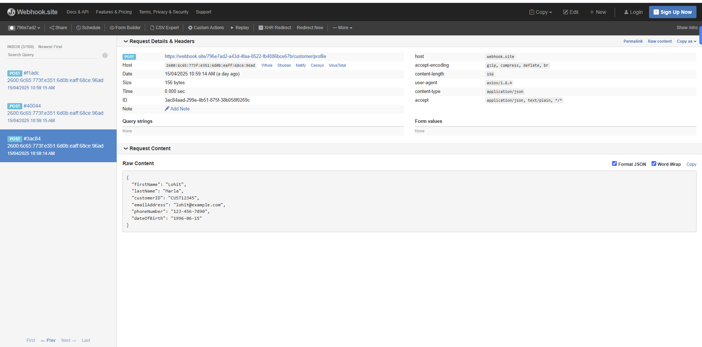
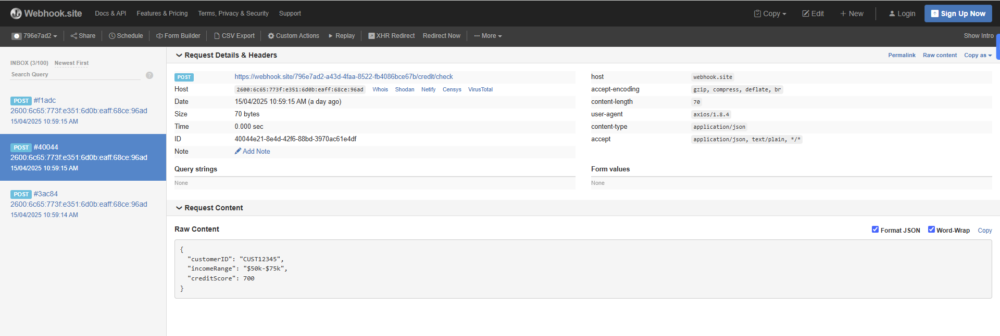
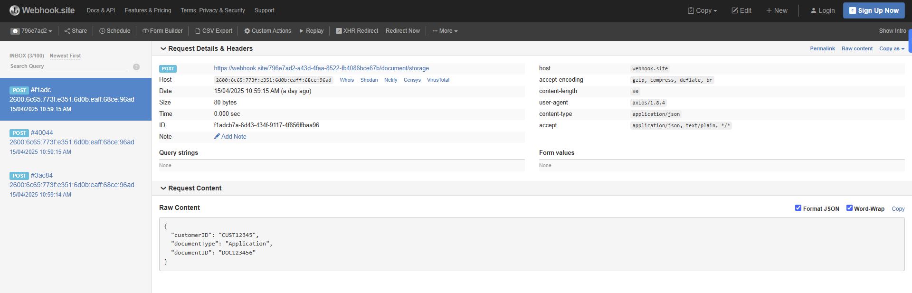
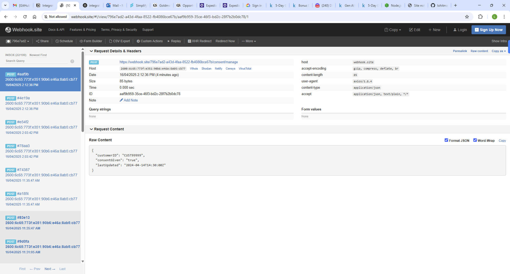
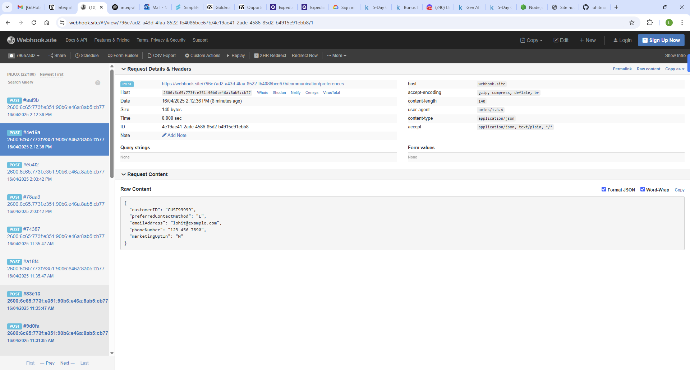

# 🛠 Integration Engineer Assignment – Multi-Source / Multi-Destination ETL Pipeline

## 🚀 Overview

This project implements a type-safe, scalable ETL pipeline that processes form data submissions and routes them to customer-specific API endpoints. It features field-level transformation, validation, error handling, retry logic, and LLM integration using OpenAI GPT.

---

## 📦 Features

- 🔀 Multi-endpoint routing based on customer configuration
- 🧠 Intelligent field enrichment using OpenAI (e.g., `processingNotes`)
- 🧪 Field validation for types, formats, and required fields
- 🧰 Custom transformation logic (e.g., name splitting, enum-to-code)
- 🔁 Retry logic for failed API requests
- ⚡ Parallel processing of endpoint calls
- 📜 TypeScript interfaces and strict typing
- 🧪 Unit tests using Jest and ts-jest
- 🌐 Environment config using `.env`

---

## 🧱 Architecture

```
index.ts
└── processSubmission()
    └── endpointService.ts
        ├── transformers.ts
        ├── validators.ts
        ├── openAIService.ts
        └── axios → webhook.site endpoints
```

---

## 🧰 Tech Stack

- Node.js
- TypeScript
- Axios
- Jest + ts-jest
- OpenAI API (gpt-3.5-turbo)
- dotenv for config

---

## 📁 Setup Instructions

```bash
git clone https://github.com/lohitmarla-uconn/integration-etl-project.git
cd integration-etl-pipeline
npm install
```

---

## ⚙️ Configure Environment Variables

Create a `.env` file in the root directory with:

```env
OPENAI_API_KEY=sk-xxxxxxxxxxxxxxxxxxxxxxxxxxxxxxxxxxxx
WEBHOOK_BASE_URL=https://webhook.site/your-id
```

Make sure to **exclude `.env` from Git** using `.gitignore`.

---

## ▶️ Run the ETL Pipeline

```bash
npx ts-node src/index.ts
```

You’ll see formatted logs for each endpoint and webhook.site will receive the payloads.

---

## 🧪 Run Unit Tests

```bash
npx jest
```

All core modules (`transformers`, `validators`, `pipeline`) are covered with basic tests.

---

## 👥 Supported Customer

- `CUST12345` – Preconfigured customer with 3 endpoint mappings
- `CUST99999` - Preconfigured customer with 2 endpoint mappings

---

## 💡 Example Transformations

| Field             | Transformation Logic                      |
|------------------|-------------------------------------------|
| `personalName`    | Split into `firstName` + `lastName`      |
| `priorityLevel`   | Enum → Number (e.g., "High" → 3)         |
| `processingNotes` | Enriched via OpenAI GPT                  |
| `deviceType`      | Full → Single letter or full word        |
| `accountType`     | Enum → Numeric code                      |

---

## 🔒 Git Safety

Ensure your `.env` file is not pushed:
- Add `node_modules/`, `.env`, `dist/` to `.gitignore`
- Commit `.env.example` if needed for sharing structure

---

## 🔮 Future Improvements

- Integrate Prometheus + Grafana for metrics dashboard (processed count, failures, retries)
- Save logs to file or DB for persistent tracking and auditing
- Add Slack/email alerts for endpoint failures or API downtime
- Add job status tracker per submission (`processed`, `failed`, `skipped`)
- Dynamic customer config loading via API or DB
- CLI form submission mocker for local testing
- Support for batch form ingestion (e.g., from CSV)
- Switchable model integration (OpenAI ↔️ Anthropic)
---

## ✍️ Author

**Lohit Marla**  
Email: lohitmarla@gmail.com  
GitHub: [github.com/lohitmarla](https://github.com/lohitmarla)

---

## 📸 Screenshots 




 
